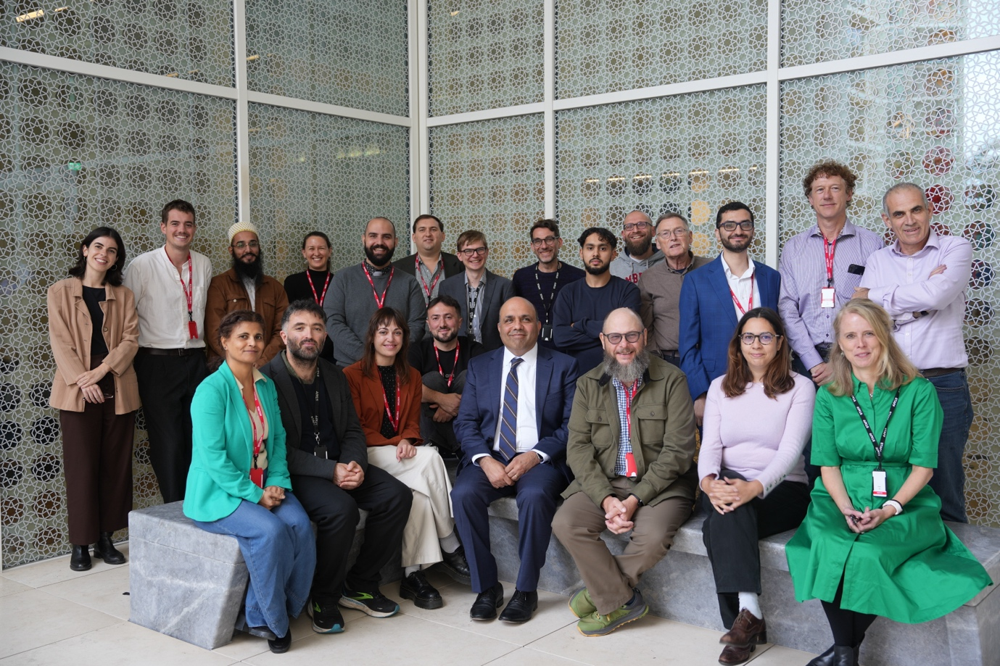

The Aga Khan University’s Institute for the Study of Muslim Civilisations (AKU-ISMC), in collaboration with Queen Mary University of London, hosted a two-day workshop titled **“Arabic Pasts: Histories and Historiography”** on **9–10 October 2025**.

Across seven panels, 23 scholars presented their research, sharing fresh perspectives on Arabic historiography and topics ranging from medieval archival records to modern local histories. The workshop was preceded by a workshop on digital methods led by the AKU’s Centre for Digital Humanities.

Arabic Pasts is an annual, informal, and exploratory workshop that provides a space to engage with new methodologies, case studies, and research directions in the study of history writing in Arabic—from the seventh century to the present, and across the Middle East, North Africa, and beyond.

We are grateful to all participants for their contributions and intellectual energy. **We look forward to welcoming you again in October 2026!**

The programme agenda for AP 2025 can be accessed by clicking [here](https://kitab-project.org/documents/Arabic_Pasts_Schedule_2025.pdf)

**A group photograph with presenters and the organisers.**
