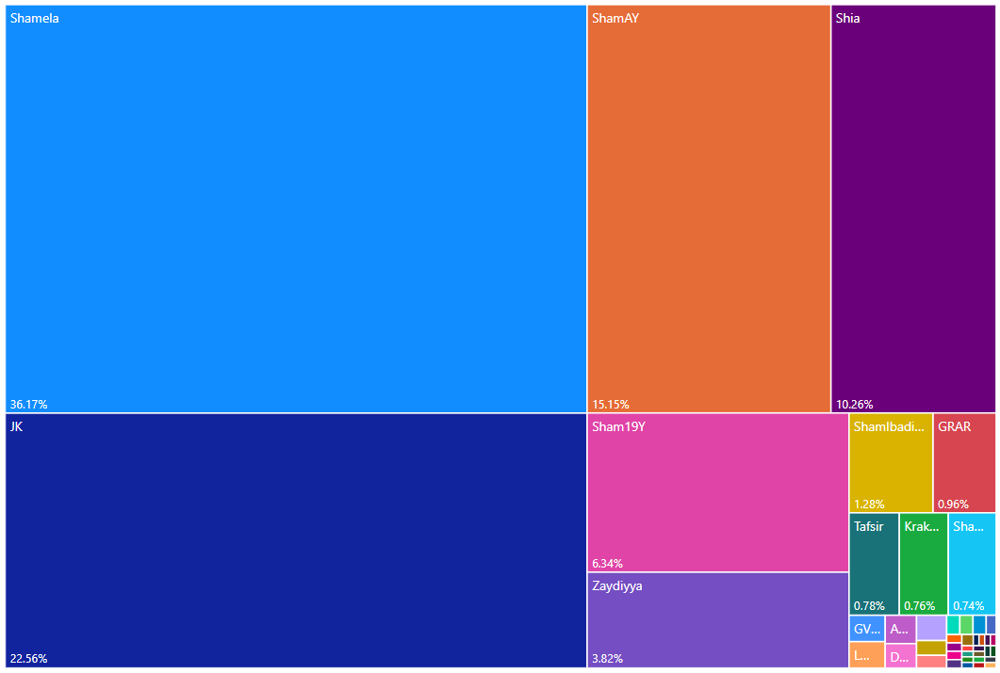
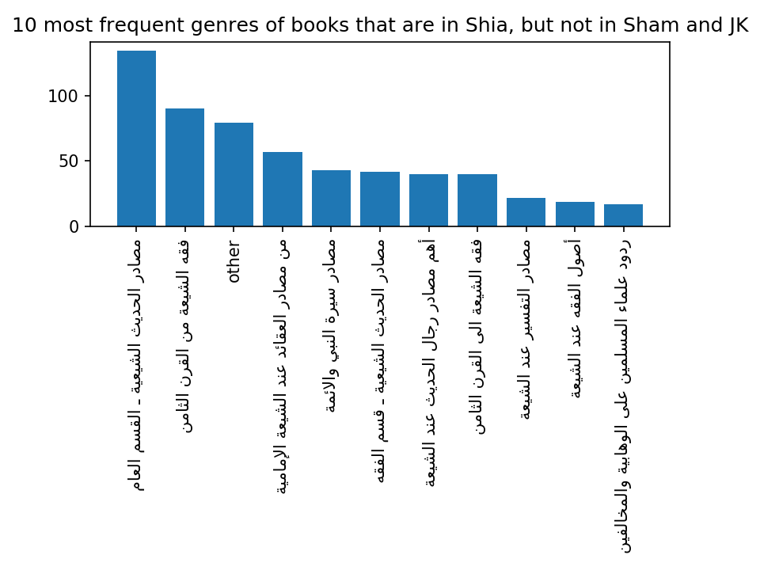
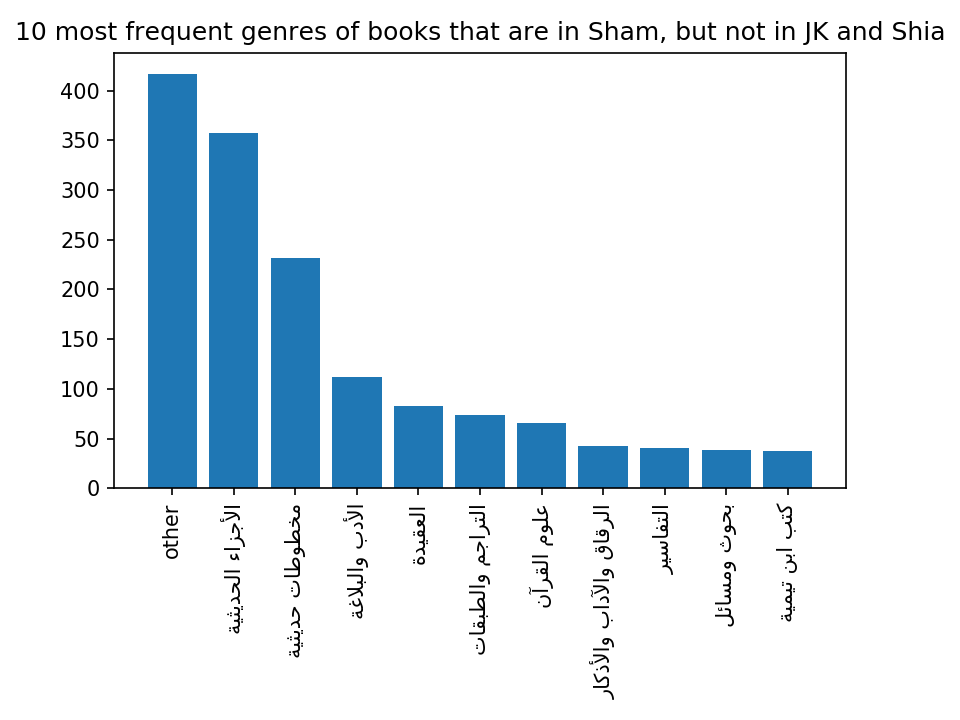

# Bias in the OpenITI corpus

(Note: This is the second blog in a series of blogs on the sources of the OpenITI corpus. It was written in 2021 but not published at the time. It is based on the state of the OpenITI corpus as it was in 2021 – release no. 2021.1.4 – and has not been updated to reflect the current state of the OpenITI corpus)

Although the OpenITI corpus aims at being all-inclusive, it is subject to different types of bias. The most important is ‘**survivor bias**’: it can only include books that have survived the ravages of time. Many books have not made it to the present day because of the fragility of the material they were written on. A major factor in the survival of works is **selection**. As a general rule, only those works survive that were considered worthy / interesting enough to be read, stored, and copied. Of course, some manuscripts survive that had been discarded by their owners, for example in the rubbish heaps of Egypt, the Genizah of the Ben Ezra synagogue in Fustat (Cairo), the cache in the Old Mosque of Ṣana and the Qubbat al-Khazna of the Umayyad Mosque in Damascus, but these are the exceptions.

In addition to survival bias, we also have to take into account what we may call ‘**accessibility bias**’: if a manuscript survives but is unknown to the world of scholarship because it is hidden in a forgotten storage room in a mosque, an inaccessible library or private collection, or even an uncatalogued part of a publicly accessible library, it might as well not exist for research purposes until it is brought out into the open. But accessibility bias goes much further than this: the degree of accessibility of the collection a manuscript is stored in, its physical distance from an individual researcher, how widespread the catalogues that mention it are, the number of times it is cited in scholarship, are only a couple of examples. Arguably the main factor at this stage, however, is the question whether a work was ever printed – and more recently, microfilmed or digitized. These surrogates for manuscripts are generally way more accessible than the originals: a manuscript that existed in a handful of copies will suddenly be available in thousands of copies once printed, in many locations, at a fraction of the price; microfilm copies of a manuscript can be reproduced quickly and relatively cheaply; digital copies can be made available online for free (or reproduced for a limited fee as a source of income by the institution that holds them). Selection plays a major role here as well: which (parts of) collections are deemed worthy of cataloguing? Which works were considered interesting enough to be printed, digitized or microfilmed? These selection processes are partly driven by scholarly, ideological and economic factors.

The OpenITI corpus has been built up gradually, from 2016 onwards. The bulk of its texts was established in the first stage by collecting ‘low-hanging fruit’, texts from large collections of digital texts that were freely available on the internet: by writing one single conversion program, thousands of texts from a single collection could be added to the corpus. The most important of these is *al-Maktaba al-Shamila* (‘The Comprehensive Library’, www.shamela.ws), which we will refer to in the following as Shamela. In later stages, texts from smaller collections were added, in an attempt to broaden the scope of the corpus with respect to subject matter and representation of religious communities.[^1]

<figure>

<figcaption>
Figure 1 Treemap diagram representing the source collections of the texts in the OpenITI corpus (release 2021.2.5) About 75% of all texts come from three collections: al-Maktaba al-Shamila (Shamela + Sham 19Y), al-Jamiʿ al-Kabir (JK) and ShiaOnline (Shia).
</figcaption>
</figure>

Most of the OpenITI’s main source collections were built up in the same way as the OpenITI itself, by aggregating smaller collections of digitized texts. Each of these collections are subject to accessibility and selection bias: which materials were available to them? Which materials did they find interesting enough to digitize or collect? Since the OpenITI inherits all types of biases from these source collections, it is useful to study their backgrounds. We can assess the selection bias of each of these source collections in a number of ways: one is to analyze the provenance of their texts; the second, to analyze the representation of different genres in each collection; thirdly, we can look into the background of the organizations that created these collections, and their sponsors; and finally, we can draw conclusions from the (lack of) overlap between the different source collections.

Let us take Shamela as an example: it started in about 2003 as a personal project of an Egyptian computer programmer with an interest in Islamic texts, known only as Nāfiʿ. According to his [own statement](https://web.archive.org/web/20051001064538/http:/www.ahlalhdeeth.com:80/vb/archive/index.php/t-30204.html), he initially created a full-text database for all digital texts he had collected from a range of sources (including public websites, internet forums and commercial collections distributed on CD-ROMs), in order to be able to search them all at once. Originally meant for his own personal use, it became a popular resource on internet forums aimed at Sunni hadith scholars and enthusiasts. Finally, it was turned into a not-for-profit company, which continues to produce a database-driven collection of digital, searchable texts, available for download for free.[^2] By 2013, its primary sponsor boasted that it had already been downloaded millions of times.[^3] It continues to be widely used in education and research in the Islamic world, and in Western academia, to this day; the version released in 2020, contains about 8.000 texts. (For a more detailed history of Shamela, see my [earlier blog](https://kitab-project.org/Al-Maktaba-al-Shāmila-a-short-history/)).

## Shamela’s Ideological background

We do not know much more about the creator of Shamela than his first name, Nāfiʿ, and his country of residence (Egypt). Circumstantial evidence suggests his Sunni traditionist background. He was an active member of the Ahlalhdeeth forum,[^4] a discussion forum devoted to the study of hadith and Qur’an. The fact that the earliest versions of the program were first circulated on Ahlalhdeeth and similar discussion fora suggests that its target audience was also primarily found there. In early posts about Shamela in which forum users offer to send it to others who cannot download it, the people whom this should interest are referred to as *tullab al-ʿilm* (‘seekers of learning’, a term used most often for scholars in the fields of religious knowledge transferred by oral transmission).[^5] Early on, the Shamela website itself contained a disclaimer that it was not allowed to use the program to publish material that strays from the path of the *ahl al-sunna wa-al-jamaʿa* (a self-descriptive term for Sunni Muslims); it goes on to explain that books of the *ahl al-bidaʿ* (‘the people of innovations’, a derogatory term for heterodox (non-Sunni) Muslims) may be loaded into Shamela, but only to refute them.[^6] The fact that the program has been prominently sponsored by Saudi organizations like the *daʿwa* centre of al-Rawda[^7] is in line with this conservative Sunni profile. The clearest indication that Shamela does not only have a staunchly Sunni background, but is connected to the Salafi movement in Egypt, is the fact that in April 2012, a banner supporting Hazim Salah Abu Ismaʿil, a popular Salafi candidate in the Egyptian presidential elections, was displayed on the homepage of the Shamela website.[^8]

## Shamela’s bias: Origin of the Shamela texts

The more recent versions of Shamela do not mention the origin of the texts. Neither did the first version (2003-2005). An analysis of the provenance of the texts in the earliest documented version of Shamela v. 2 (2006)[^9] shows that more than 90 percent of its texts came from four openly available internet collections. The largest group of texts (more than 35%) came from the website al-Warraq (alwaraq.net), one of the earliest projects aimed at creating a collection of important primary texts of the Arabic and Islamic heritage, set up by the Emirati poet and publisher [Muhammad al-Suwaydi](https://web.archive.org/web/20190707094521/https://ar.wikipedia.org/wiki/محمد_أحمد_خليفة_السويدي) in 1998. A second batch was taken from the website al-islam.com, at the time one of the largest Islamic portal websites in the world, created by the Kuweiti/Egyptian company Harf (founded in 1997 as an offshoot of a former daughter enterprise of the Arabic technology giant [Sakhr](https://web.archive.org/web/20211002015347/https://en.wikipedia.org/wiki/Sakhr_Software_Company), founded in 1982). One of the main activities of the company was the production of digital text collections on hadith (*Mawsuʿat al-Hadith al-Sharif*, ‘Thesaurus of Respectable Hadith’),[^10] sira (*Mawsuʿat al-Sira al-Nabawiyya*, ‘Thesaurus of the Biography of the Prophet’),[^11] and other Islamic topics. The third major source of texts was the website of the Hadith encyclopaedia *Jamiʿ al-Hadith al-Nabawi* (‘The Comprehensive Prophetic Hadith Collection’, www.sonnhonline.com), created by the Egyptian company Riwaya, and presented as a charitable service.[^12] A fourth important source was *Maktabat Yaʿsub al-Din al-iliktruniyya* (‘Electronic Library Yaʿsub al-Din’, yasoob.com), a shiʿi website (named after a nickname given to ʿAli b. Abi Ṭalib by the Prophet Muhammad). For about 100 books, no source is indicated. In the course of 2007, 800 new books from about thirty different websites were added; only one new source of books brought in more than 100 new books: *Maktabat al-Madina al-Raqamiyya* (‘Medina Digital Library’, raqamiya.org). This website was connected to the Saudi-owned[^13] *Jamiʿat al-Madina al-ʿAlamiyya* (‘Al-Madinah International University’), a private university in Malaysia. It was launched by the end of 2004 with ca. 7.250 digital books on a wide variety of (mostly Sunni Islam-related) topics.[^14]

## Shamela’s bias: Overlap with other source collections

Most books in the Shamela collection thus came from Sunni websites. The contents of the collection points in the same direction. The collection is divided into categories, mostly by subject-matter (e.g., “Books on Hadith’, “Books on History’). Of the original categories, only two categories were organized around authors:[^15] *Kutub Ibn Abi al-Dunya*[^16] and *Kutub Ibn Taymiyya*.[^17] Later, two author-related categories were added: *Kutub Shaykh al-Albani*[^18] and *Kutub Ibn al-Qayyim*.[^19] All four authors are heroes of the Salafi movement. Moreover, the original Shamela collection contained almost no poetry, which has a bad reputation among Salafis. By far the largest number of books in the Shamela collection is connected to religious matters, especially hadith and Qur’an.

In order to get a better idea of the bias in the content of the Shamela collection, it is instructive to compare the books in the three largest collections. 4290 out of the 5104 distinct works in OpenITI release 2021.1.4 come from the three main source collections (Shamela, al-Jamiʿ al-Kabir (JK) and Shia Online Library (ShiaOL)). These three collections overlap to a significant extent (see Figure 2).

<figure>

<figcaption>
Figure 2 Overlap of the main source collections of OpenITI: al-Maktaba al-Shamila (Sham), al-Jamiʿ al-Kabir (JK), ShiaOnlineLibrary (ShiaOL). Data: OpenITI release 2021.1.4.
</figcaption>
</figure>

While only a small number of books, less than 10 percent of the 4290 unique works, are represented in all three collections, almost half of the books are represented in more than one collection. The books that are unique to each collection can reveal the bias of each collection. The ShiaOnlineLibrary collection (marked as ShiaOL in Figure 2) has the largest number of unique books, relative to its size: 56% of its books are not present in the other two large collections. An analysis of the most common subject tags attached to these books unique to the ShiaOL collection shows, unsurprisingly, that most of these books have a specific Shiʿi subject. Eight of the 10 most frequent genres of books in the Shia collection explicitly have ‘shiʿi’ in their names; the other two contain ‘sources for the life of the Prophet and the imams’, and ‘Replies of Muslim scholars to Wahhabis and \[other\] opponents’:

<figure>

<figcaption>
Figure 3 Ten most frequent subject tags of books that are in ShiaOL but not in Shamela and JK (subject tags defined by the ShiaOL collection itself; ‘other’ aggregates all other subject tags)
</figcaption>
</figure>

As for the Shamela collection, by far the largest set of unique texts are transcriptions of hadith manuscripts (see Figure 4).[^20] The other ten most frequent subject tags for books unique to Shamela include a number of religiously-flavoured tags (Qur’anic sciences and exegesis, dogma); in contrast to the ShiaOL collection, the sectarian background of these tags is not explicitly specified, but they clearly belong to the Sunni spectrum. In the top ten, we also find books beyond the religious fields of knowledge in a narrow sense, such as *adab* and history.

<figure>

<figcaption>
Figure 4 Ten most frequent subject tags of books that are in Shamela but not in ShiaOL and JK (subject tags defined by the Shamela collection itself; ‘Other’ aggregates all other subject tags)
</figcaption>
</figure>

## Conclusion

Building a collection of digital texts involves a lot of human labour (collecting metadata, scanning, OCR’ing and/or double-keying texts) and monetary costs. It is not surprising that organizations that build collections of digital texts focus their efforts on texts that they find interesting and useful. The OpenITI corpus inherits the selection biases of its source collections, but we try to detect gaps in the corpus of groups of texts that have not yet been digitized, and attempt to digitize these ourselves.

[^1]: An updated list of all sources for OpenITI texts can be found [here](https://github.com/OpenITI/Annotation).

[^2]: [https://www.shamela.ws](https://www.shamela.ws)

[^3]: Al-Maktaba al-taʿāwuni li-al-daʿwa bi-al-Rawda, *Al-Maktaba al-Shamila* (2013), 6-7. [link](https://web.archive.org/web/20131126021834/http://www.arrawdah.com/files/shamela.pdf)

[^4]: [http://ahlalhdeeth.com](http://ahlalhdeeth.com). The forum became read-only around the end of January 2020 (the [first archived page](https://web.archive.org/web/20200201192408/http://ahlalhdeeth.com/vb/) on the Internet Archive with this announcement dates from 1 February 2020) and seems to have gone offline in early 2021 ([last snapshot](https://web.archive.org/web/20210211051107/http://ahlalhdeeth.com/vb/) of the working website on the Internet Archive was on 11 February 2021). Some archived threads are available on web.archive.org (https://web.archive.org/web/\*/https://www.ahlalhdeeth.com/vb/archive/index.php/t-\<THREAD_NUMBER\>.html), and a dump of the forum’s archive until 2010 is available on [al-maktaba.org](https://web.archive.org/web/20211019040209/https://al-maktaba.org/author/1101).

[^5]: E.g., in the earliest extant discussion thread about Shamela on the Ahlalhdeeth forum (archived [here](https://web.archive.org/web/20211201135259/https://al-maktaba.org/book/31617/72444)), from July 2005: ‘it contains everything a *talib al-ʿim* needs’. *Talab al-ʿilm* was the technical term for the journeys religious scholars undertook to gather transmitted forms of knowledge, especially of hadith. See n.n., ‘ʿIlm’, in *Encyclopaedia of Islam*, 2nd ed., [url](http://dx.doi.org/10.1163/1573-3912_islam_SIM_3537)

[^6]: [www.shamela.ws/help.php](https://web.archive.org/web/20070314191448/http://www.shamela.ws/help.php) (archived)

[^7]: A banner advertising this sponsorship was prominently displayed on the shamela.ws website from [June 2012](https://web.archive.org/web/20120614064312/http://shamela.ws:80/index.php/main) until [October 2015](https://web.archive.org/web/20151003102549/http://shamela.ws:80/index.php/main).

[^8]: [http://shamela.ws:80/index.php/main](https://web.archive.org/web/20120418052924/http://shamela.ws:80/index.php/main) (archived). On Abū Ismāʿil, see [here](https://web.archive.org/web/20140419234025/https://www.middleeasteye.net/news/profile-hazem-abu-ismail).

[^9]: Data published [here](http://www.ahlalhdeeth.com/vb/showpost.php?p=397080) (not archived on archive.org).

[^10]: For a study of this collection, see Ibrāhim b. Ḥamād al-Sulṭān al-Rayyis, *Barnāmij Mawsūʿat al-ḥadith al-sharif. ʿArḍ wa-naqd*, Riyad: King Saud University (n.d.), [url](https://archive.org/details/rayyis-barnamij-mawsu3at-hadith-sharif)

[^11]: Ibrāhim b. Ḥamād al-Sulṭān al-Rayyis, ‘Al-Taqniya al-ḥaditha fi khidmat al-sunna wa-al-sira al-nabawiyya’, [www.alukah.net/sharia/0/19212/](https://web.archive.org/web/20180807032528/https://www.alukah.net/sharia/0/19212/) (2/1/2008, archived). 

[^12]: [http://www.sonnhonline.com/Who.aspx](https://web.archive.org/web/20061208185039/http://www.sonnhonline.com/Who.aspx) (no date, first archived in 2006). 

[^13]: Muḥammad Lāfi, ‘Jāmiʿat al-Madina al-ʿĀlamiyya. al-taʿlim al-mustaqbali bi-taqniyāt al-ḥāḍir’, *Almoslem.net* (1 February 2014), [http://almoslim.net/node/184308](https://web.archive.org/web/20200118022131/http://almoslim.net/node/184308) (archived).

[^14]: The [earliest version of the website archived](https://web.archive.org/web/20041231010916/http://www.raqamiya.org/) by the Internet Archive dates to 31 December 2004 (at which time it had received only 346 visitors).

[^15]: See the first extant description of Shamela on the Ahl al-Hadeeth forum (July 2005), archived [here](https://web.archive.org/web/20211201135259/https://al-maktaba.org/book/31617/72444#p4)

[^16]: See Albert Dietrich, ‘Ibn Abi al-Dunyā’, in *Encyclopaedia of Islam*, 2nd ed., [online](http://dx.doi.org/10.1163/1573-3912_islam_SIM_3046)

[^17]: See Henri Laoust, ‘Ibn Taymiyya’, in *Encyclopaedia of Islam*, 2nd ed., [online](http://dx.doi.org/10.1163/1573-3912_islam_SIM_3388)

[^18]: See Emad Hamdeh, ‘al-Albāni, Nāṣir al-Din’ (Emad Hamdeh), in *Encyclopaedia of Islam, THREE*, [online](http://dx.doi.org/10.1163/1573-3912_ei3_COM_30004)

[^19]: See Henri Laoust, ‘Ibn Ḳayyim al-Djawziyya’, in *Encyclopaedia of Islam*, 2nd ed., [online](http://dx.doi.org/10.1163/1573-3912_islam_SIM_3242)

[^20]: Shamela tags: *al-ajzā’ al-ḥadithiyya* and *makhṭūṭāt ḥadithiyya*. The majority of these seem to come from the sonnhonline.com website.
