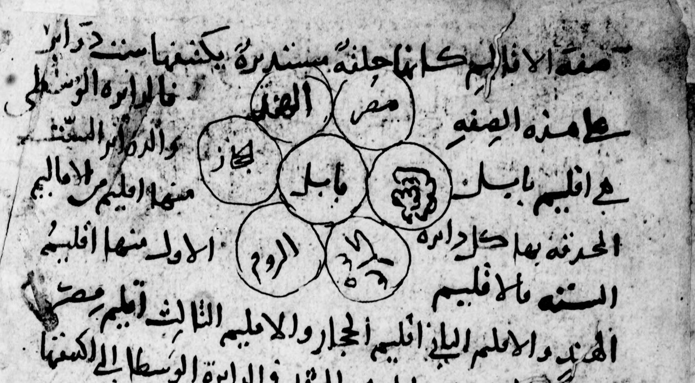

**Arabic Pasts: Histories and Historiographies**\
\
**Research workshop**\
\
The Aga Khan University’s Institute for the Study of Muslim Civilisations (AKU-ISMC)\
\
**October 08–09, 2026\
London**

The annual Arabic Pasts workshop brings together scholars at all career stages to reflect on methodologies, research agendas, and case studies for investigating history writing in Arabic in the Middle East, North Africa, and beyond in any period from the seventh century to the present.

This year’s Arabic Pasts workshop again welcomes Queen Mary University of London (QMUL) as a partner. We will host the workshop in person at the Aga Khan Centre (AKC) and welcome proposals that deal with the practical and conceptual challenges of working on history writing in Arabic.

We encourage scholars working at all career stages to join us.

By way of example, papers might elucidate the following sorts of questions – or others:

- How do nations today tell their stories with respect to their pasts? In what ways do educational institutions, museums, media organisations and proponents of heritage use history writing to shape loyalties and senses of belonging in society?

- When and how did pre-modern and modern historians writing in Arabic conceptualize the history of Palestine as a distinct geographical and political unit? What are the Arabic historiographical traditions regarding the city of Gaza and its hinterland, and how have they developed in the last two centuries?

- How is the past of the Near East used in creative arts, re-enactment, games, and augmented reality? What about pedagogy of historiography regarding the use of video games, movies and podcasts in teaching? How do we responsibly teach critical thought regarding the different forums of specialist and non-specialist content?

- What do we consider works of fiction and how do they differ in authorial intent from historical chronicles? Does this authorial intent make a difference in how we treat these sources? Does the blurry boundary between fiction and non-fiction become more clear when we look at competing histories?

- What is the relationship between Arabic and other languages and scripts in bi/multi-lingual and bi/multi-alphabetic texts (tarikh, documents, other genres) across time?

- How can marginalised communities and their varieties of Arabic be given due attention?

- How can all genders (including non-binary) be given due attention when our sources are often composed by male political, intellectual and religious elites?

- How can we explore the past algorithmically? Can digital methods enhance our understanding of the past? Can they also limit or even alter it? Which new digital tools are being developed? What seem to be particularly promising approaches? What is lacking?

Arabic Pasts is co-convened by Anna Chrysostomides (QMUL), Hugh Kennedy (SOAS), Lorenz Nigst (AKU-ISMC), Yossi Rapoport (QMUL), and Sarah Bowen Savant (AKU-ISMC).

Please submit an abstract of 300 words or less by **Friday, 16 April 2026 by clicking [here](https://forms.cloud.microsoft/r/3P5D4Gzc6i).**

On **March 13, 2026, 2:00–4:00 PM (GMT)**, we will arrange **consultancy calls via Zoom** for those who wish to discuss their proposals prior to submission. The slots for these calls will be limited to 15 minutes and will be offered strictly on a first-come, first-served basis. Please, register for a slot [**here**](https://forms.cloud.microsoft/r/6HVPpGKHMF).

**Arabic Pasts Companion Programme**

In addition to the core programme of Arabic Pasts on October 08–09, we offer participants the opportunity to attend two autonomous events that frame the Arabic Pasts workshop:

1)  On **October 07, 2026**, the day before the Arabic pasts workshop, we will run a **workshop focused on the curation of the OpenITI corpus and corpus building.** Please, get in touch early if you are interested in joining as we will have to cap participation. Seats are limited and will be assigned on a first-come, first-served basis. Please click [here](https://forms.office.com/r/mP5LSuzVeR) to submit your interest.

2)  On **October 10, 2026**, the day after the Arabic pasts workshop, we will organise a **workshop which specifically focuses on Miskawayh (d. 1030)** who contributed to the intellectual life of his time in many different ways. Miskawayh’s work has been the subject of a number of studies but they mostly concentrate on one aspect of his work, as philosopher or historian, to the exclusion of his other interests. This workshop will try to bring the various strands together for the purpose of discussion and possible publications. Among the subjects to be discussed could be the following – or others (please do propose!):

<!-- -->

1.  The writer as actor, to investigate his administrative career as a Buyid chancery official and the values it taught him.

2.  Miskawayh and Abu Hayyan al-Tawhidi: the philosophical sparring.

3.  The *Tajarib* and the *Akhlaq* what is the connection between these two works.

4.  The sources and composition of the *Tajarib.*

5.  The *Tajarib* as the earliest major witness to Tabari’s *Ta’rikh.*

6.  Miskawayh and Ibn al-Athir: comparing how these two great scholars used Tabari’s *Ta’rikh.*

	Submissions for this workshop are separate from the submissions for the Arabic Pasts workshop. Please, submit your paper proposal [here.](https://forms.cloud.microsoft/r/jBRLXfR0VN)

**Image credit: Anonymous: Mukhtaṣar Tārīkh al-Khaṭīb al-Baghdādī, BnF Arabe No. 2132, 3v (part).**
